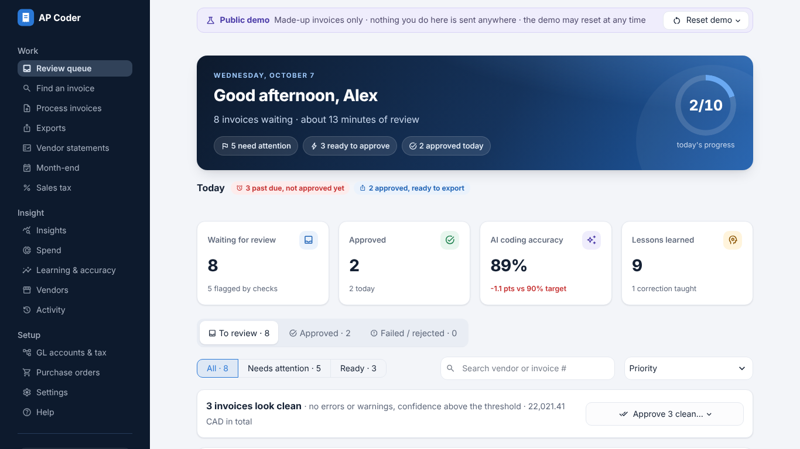
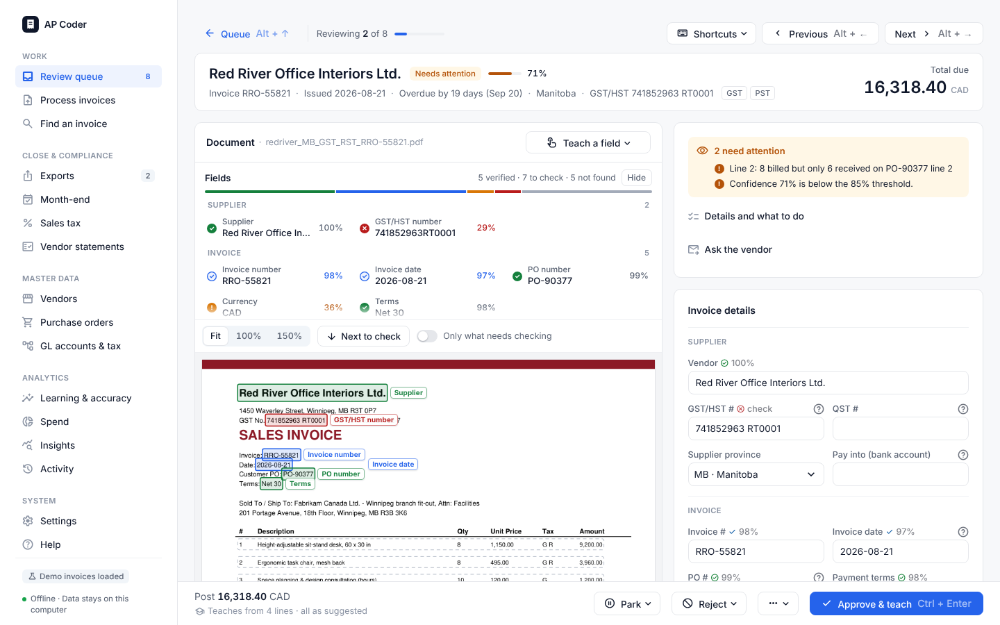
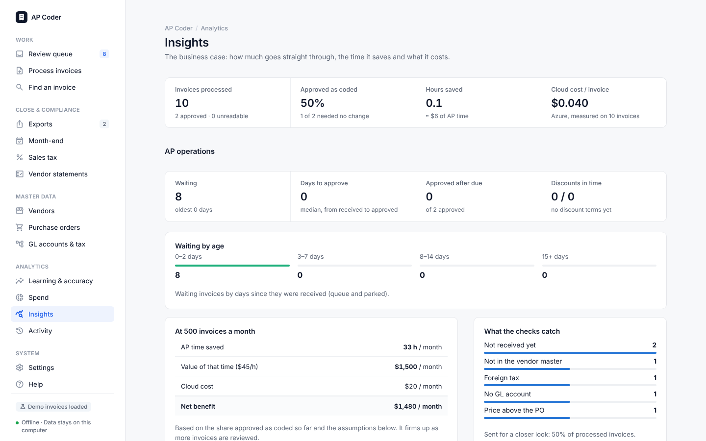
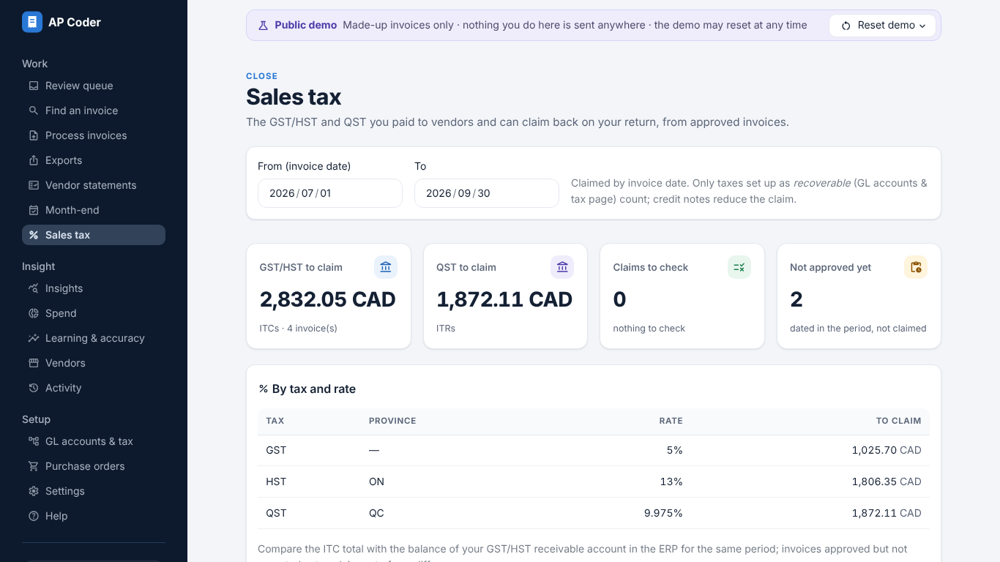
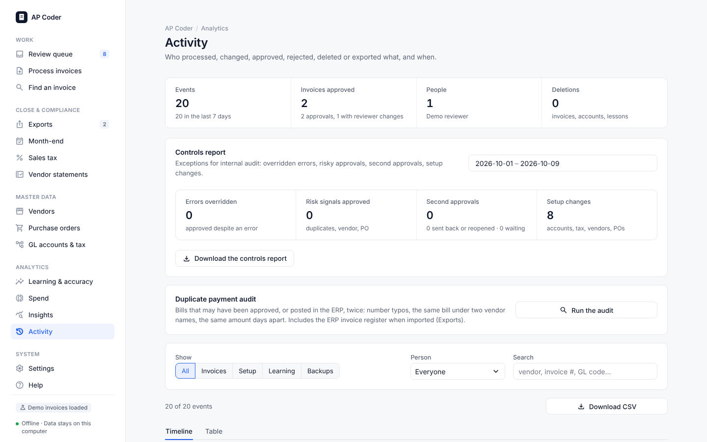
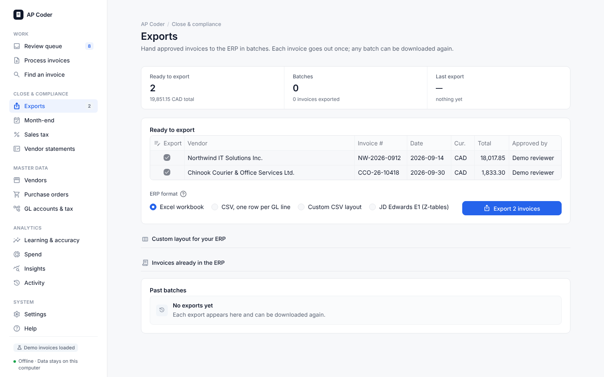
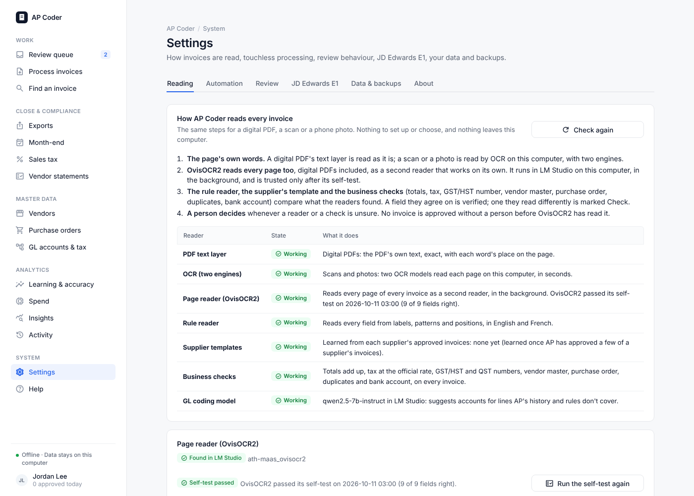

# AP Coder

**Invoice capture, GL coding and Canadian sales-tax checks for Accounts Payable, on one laptop.**
AP Coder reads each invoice, checks every number, proposes the GL split and learns from what AP approves.
It then exports approved invoices to JD Edwards E1. It runs fully offline. A local model in
[LM Studio](https://lmstudio.ai/) (Qwen 3.5 9B for the pilot) is optional, and no data leaves the laptop.



## Set up: one double-click

1. **Unzip AP Coder** to a folder that OneDrive does not sync (e.g. `C:\APCoder\app`).
2. **Double-click `APProcessor.bat`** (Mac: `APProcessor.command`; the first time, right-click → *Open*).

That's it, the first time and every day after. The launcher looks at what is already on the computer and adds
only what is missing:

- **Python:** it uses the Python 3.11–3.13 already installed. Only if there is none does it offer, once, to
  install Python 3.12 for you.
- **Packages:** it sets up its own environment (`.venv`) once and installs only missing packages. Your
  system Python and other programs are not touched.
- **OCR models, data folder, desktop shortcut:** each is made once, only if it is not there yet.
- **Self-check:** it reads the ten sample invoices and one scan, then shows what is ready and opens the
  dashboard:

```
AP Coder readiness:
  [OK] Python 3.12.10 (.venv)
  [OK] Packages: all 13 in place
  [OK] OCR for scanned invoices
  [OK] Data folder: C:\Users\you\APCoder
  [OK] LM Studio: model qwen3.5-9b loaded
  [OK] Desktop shortcut 'AP Coder' made (once)
  [OK] Self-check OK: 10 of 10 sample invoices read right, and a scan with local OCR
```

The first time takes a few minutes. Later starts take seconds and install nothing. Double-clicking while AP
Coder is running opens the running copy. After an update, only new packages are installed. A damaged
`.venv` is rebuilt on its own. Keep the window open while you work, and close it to stop AP Coder. Your data
lives in `~/APCoder`, outside the code, so updates never touch it. On a clean Windows machine, CI checks
every change: it confirms the existing Python is used, a second start installs nothing, only one copy runs,
and only one shortcut is made.

No internet on the laptop? Build the offline bundle (`python scripts/build_offline_bundle.py`). The same
double-click then installs from its `wheelhouse/` folder. `install.bat` / `install.sh` and `start.bat` /
`start.sh` still work for older shortcuts; they run the same setup. The full pilot guide is
[docs/PILOT.md](docs/PILOT.md). The step-by-step for real data is
[docs/GETTING_STARTED.md](docs/GETTING_STARTED.md).

**Optional: local AI with LM Studio.** Install LM Studio (0.4.8 or newer) and download **Qwen 3.5 9B**
(Q4_K_M). Load it with *Context Length 8192*, then go to **Developer → Start server**. AP Coder finds it
on its own; see *Settings → AI model*. Without a model everything still works: lines are coded from what
AP approved before for that vendor, from fixed rules and from account names. With a model, AP Coder also
proposes accounts for lines it has not seen yet.

## Screens

| | |
|---|---|
|  |  |
|  |  |
|  |  |

**Just want to look around?** Start the dashboard and click *Load demo invoices*. You get ten sample
invoices from across Canada, with sample POs and a vendor list. A hosted copy is at
[ap-coder-demo.streamlit.app](https://ap-coder-demo.streamlit.app) ([how it is set up](docs/DEMO.md)).

## What it does

1. **Reads the invoice on the laptop.** AP Coder uses the PDF's text layer, or local OCR (RapidOCR
   PP-OCRv4, with a PP-OCRv5 second read) for scans and photos. It reads the header, every line, and every
   GST, HST, PST and QST line. Each field gets a measured confidence (*verified*, *likely*, *check* or
   *missing*) and is boxed on the page. Optionally, a **page reader** (OvisOCR2, a small vision model in
   LM Studio) reads each scan again on its own in the background, as an independent second reader.
2. **Codes each line** to your GL accounts and cost centers. It tries, in order:
   - fixed rules set by AP;
   - what AP approved before for that vendor;
   - the vendor master's default account;
   - account names;
   - the local model, only for what is left.

   It can only pick codes from your chart, never invent one.
3. **Checks everything in code, not by AI:**
   - totals reconcile;
   - tax = taxable amount × the official rate for the province and date, the right regime, and the QST base;
   - registration numbers;
   - duplicates (also under another vendor name, or already in the ERP), and vendor fraud signals
     (unknown or held vendor, changed GST number or bank account);
   - credit notes, the PO match (price, quantity ordered and received), payment terms and discounts;
   - agreement with past decisions.
4. **Builds the GL distribution.** The posting lines add up to the amount payable to the cent. Recoverable
   GST/HST and QST go to their own accounts; non-recoverable PST is spread over the expense lines.
5. **Review and learning.** AP reviews, corrects and approves. Every approval is remembered and used for that
   vendor's next invoice. Once a supplier's own invoices prove at least 99% accurate, a manager can switch
   it to touchless.
6. **The rest of the AP cycle:**
   - ERP export batches, including JD Edwards E1 F0411Z1/F0911Z1 Z-files;
   - *Find an invoice* for vendor calls, and vendor emails drafted for you;
   - second approval above a limit;
   - vendor statement reconciliation and month-end accruals;
   - the sales-tax claim, spend analysis and a duplicate payment audit;
   - the audit trail with a controls report;
   - the business case, built from the pilot's own numbers.

```
invoice (PDF, scan, photo, .eml) ─► local reader: text layer or OCR ─► fields + confidence, boxed on the page
        └─► page reader (vision model, optional, in the background) ─► agrees: verified · differs: check
                                                                     │
   fixed rules · vendor history · vendor master · account names ─────┤  local model (LM Studio),
                                                                     │  only for lines still uncoded
                                                                     ▼
            checks: totals · tax math · province rates · QST base · duplicates · fraud · PO match
                                                                     │
                                                                     ▼
            GL distribution ─► review dashboard ─► approve ─► learning memory ─► ERP / JDE E1 export
```

Everything stays in a local data folder outside the code (default `~/APCoder`). The dashboard only listens
on `127.0.0.1`, and a test fails if any page tries to connect to the internet. Only redacted reports
(`doctor`, `share-report`) are meant to leave the laptop.

## Run it by hand (developers)

```bash
python -m venv .venv && source .venv/bin/activate
pip install -e ".[ocr,dev]"
python -m ap_coder doctor --online   # setup check; with LM Studio running, a two-line test call
python -m ap_coder dashboard         # http://127.0.0.1:8501 (or the next free port)
python scripts/pilot_check.py        # reads the ten samples offline and compares them with their answers
```

### LM Studio settings

`AP_LLM_PROVIDER=auto` (the default) chooses the model in this order:

1. Azure OpenAI, if its endpoint is set;
2. else the model loaded in LM Studio, if its server answers;
3. else no AI.

**Settings → AI model** shows what was found (e.g. *Connected to LM Studio · qwen3.5-9b*). It also has
a **Test connection** button.

Qwen 3.5 is asked not to think (`reasoning_effort: "none"`, which LM Studio honours from 0.4.8 on). Replies
are still read when they come wrapped in `<think>` blocks or code fences, or when the answer is left in the
model's reasoning. If the model spends its whole budget thinking, AP Coder reports a plain error instead of
coding nothing silently. Speed and model advice are in [docs/PILOT.md](docs/PILOT.md).

| Setting | Default | |
| --- | --- | --- |
| `AP_LLM_PROVIDER` | `auto` | `local`, `azure` or `off` to choose |
| `AP_LLM_BASE_URL` | `http://127.0.0.1:1234/v1` | any address LM Studio shows; Ollama: `http://127.0.0.1:11434/v1` |
| `AP_LLM_MODEL` | empty | empty = the chat model loaded in LM Studio (never an embedding model) |
| `AP_LLM_VISION` | `auto` | `on` / `off`: show the model page images |
| `AP_LLM_MAX_PROMPT_CHARS` | `24000` | invoice text sent; a longer one keeps its start and end |
| `AP_LLM_TIMEOUT_SECONDS`, `AP_LLM_MAX_TOKENS` | `600`, `4096` | a laptop without a graphics card is slow |

**Azure stays optional.** With Azure Document Intelligence and Azure OpenAI set in *Settings → Azure*, those
services do the reading and coding instead. They use strict Structured Outputs, and every check after
coding is the same.

### Page reader: a vision model as a second reader

OCR misreads digits on phone photos and poor scans. The page reader is a small vision model that reads the
page image on its own and writes out its text and tables. AP Coder reads that with the same rule reader and
compares it with OCR, field by field:

- both read the same value: the field can be *verified* (two independent readers agree, and the checks pass);
- they read different values: the field is marked *check* for AP;
- only the page reader found it: *likely* at best.

**Set it up once:**

1. OvisOCR2 is in LM Studio already (installed by IT with the chat model: the *bartowski* build at **Q8_0**, about
   1 GB). *Settings → Page reader* shows it, and *Models in LM Studio* lists every model with whether it is
   loaded. No need to load it: AP Coder has LM Studio load it when there is a page to read. Nothing is
   downloaded: AP Coder never connects to the internet.
2. *Settings → Page reader → Test the page reader.* It reads a scan of a sample invoice whose answers are
   known and shows, field by field, what it read. When it reads it right, the model is **linked**. It reads
   nothing until then, and another model needs its own test.

It reads in the background while the dashboard is open (or overnight: `python -m ap_coder read-pages
--minutes 240`) and never holds up *Process invoices*. An invoice is in the review queue at once, read by OCR;
its fields update when the page reader is done, unless AP has started editing it.

| Setting | Default | |
| --- | --- | --- |
| `AP_PAGE_READER` | `auto` | `auto` (in the background), `ask` (only when AP clicks *Read with the page reader*), `off` |
| `AP_PAGE_READER_SCOPE` | `scans` | `scans` (scans and photos) or `all` (digital PDFs too: more fields verified, slower) |
| `AP_PAGE_READER_MODEL` | empty | empty = OvisOCR2 when LM Studio has it, else the chat model if it can see; or a model key |
| `AP_PAGE_READER_BASE_URL` | empty | empty = the same LM Studio as the AI model |
| `AP_PAGE_READER_TIMEOUT_SECONDS`, `AP_PAGE_READER_MAX_PAGES` | `1200`, `5` | a laptop CPU takes minutes a page |

**Measured** on 9 real scans with known answers ([details](docs/CAPTURE_DESIGN.md#measured-with-ovisocr2)):
OCR alone read 87 of 91 header fields right and verified 41; with the page reader, 91 of 91 right and 81
verified, line items 56 of 56 (31 with OCR alone), and no wrong value verified. A page takes minutes on a laptop
CPU, so it reads in the background.

**Building confidence for touchless processing.** Every approval scores each reader (OCR, the page reader,
the supplier's template, the AI) against what AP approved. *Learning & accuracy → Readers* shows each
reader's record, field by field. The same approvals tune the confidence labels to your own invoices (local
calibration, on top of the benchmark). *Export training data* packs the approved invoices (page images and
the approved fields) to fine-tune a vision model on them later.

## Dashboard

| Sidebar group | Page | What it does |
|---|---|---|
| Work | **Review queue** | Invoice image beside the editable header (incl. PO #, payment terms, due date, bank account to pay into); live **Checks**, each with what to do; the line grid (GL account and cost center dropdowns of your codes); tax lines with a tax-check table; the **PO match**; **GL suggestions** for lines the AI could not code; *Split a line* across GL accounts / cost centers; a GL posting preview; **Ask the vendor** drafts the email for what the invoice is missing (English or French). *Approve & teach*, *Reject*, *Delete*. The queue shows due dates and discount deadlines, can be sorted by due date, and clean invoices can be approved in bulk. A **Second approval** tab holds invoices over the approval limit; *Park* sets aside an invoice waiting for information (**Parked** tab); **Notes** keep the team informed. |
| Work | **Process invoices** | Upload files or saved emails (`.eml`, attachments taken out), or process new files dropped into the data folder's `invoices/` (or run `watch`). |
| Work | **Find an invoice** | For a vendor on the phone: search by vendor, invoice or PO number, or amount; see where each invoice is (in review, parked and why, approved by whom, exported in which batch, rejected) and when it is due; the ERP register too. |
| Close & compliance | **Exports** | Approved invoices go to the ERP in batches (Excel, CSV, or a **custom CSV layout** matching your ERP's import); each invoice once; any batch can be downloaded again or undone; **approved PDFs** (stamp and coding page) per batch. Import the ERP's invoice register to catch bills already entered there. |
| Close & compliance | **Month-end** | The accruals schedule: received not invoiced (from POs), invoices not in the ERP yet, expected recurring invoices; by GL; CSV. |
| Close & compliance | **Sales tax** | GST/HST (ITCs) and QST (ITRs) to claim back for a period, by tax and rate, with the claims to check before filing (no valid registration number on the invoice, foreign currency); PST / QST possibly to self-assess; CSV. |
| Close & compliance | **Vendor statements** | Upload a vendor's statement of account: matched, amount differs, not received, not on the statement; the email asking for the missing invoices. |
| Master data | **Vendors** | Import the **vendor master** from the ERP (vendor IDs in exports, unknown vendors flagged, vendor terms, default GL); spend, AI accuracy and controls per vendor (hold, expected GST/HST number, notes); recurring vendors and late invoices. |
| Master data | **Purchase orders** | Import open POs (one row per line, received quantities optional); what has been invoiced against each; close, reopen, delete. |
| Master data | **GL accounts & tax** | Import GL accounts (cost codes) from CSV/Excel by choosing the **code**, **description** and **category** columns; edit, categorise, delete. Optional cost centers. Tax treatments and GLs. Coding policy. **Fixed rules** (vendor and/or words → GL account and cost center), with rules suggested from past coding. |
| Analytics | **Learning & accuracy** | AI accuracy against the 90% target, weekly trend, per-vendor accuracy, most common corrections, and the memory itself (*Forget* a bad lesson). *Teach from past coding* imports last year's AP lines from the ERP. *Readers* scores each reader (OCR, page reader, template, AI) against AP's approvals and exports the training data. |
| Analytics | **Spend** | Spend by month (by GL category), top GL accounts, vendors and cost centers, net of recoverable tax; **all invoice data as Excel** (invoices, lines, GL posting) for pivot tables or Power BI. |
| Analytics | **Insights** | Straight-through rate, hours saved, cost per invoice, a monthly projection; AP operations (queue ageing, days to approve, discounts approved in time); a one-page business case to download. |
| Analytics | **Activity** | The audit trail (who did what, with every change to the AI's coding), filterable, CSV; the **controls report** for internal audit; the **duplicate payment audit** (number typos, same bill under two vendor names, same amount days apart, also against the ERP register). |
| System | **Settings** | AI model (LM Studio found automatically, with a connection test), page reader (the vision model that reads scans a second time, linked by a test on a known invoice), optional Azure connection, your name (per Windows user), review threshold, page images for the AI (vision), only-my-GL-codes, approval limit, default payment days, backups and restore (with an optional second backup folder, e.g. OneDrive). |
| System | **Help** | Quick start, every check explained, questions, shortcuts. |

## Canadian sales tax

Rates live in [`data/canada_tax_rates.csv`](data/canada_tax_rates.csv) with effective dates. For
example, Nova Scotia HST was 15% until 2025-03-31 and 14% from 2025-04-01. When a rate changes,
put a copy of that file in your data folder (`canada_tax_rates.csv`) and edit the copy: it is used
instead of the shipped one and survives updates.

| Check | Severity |
|---|---|
| Tax amount ≠ taxable amount × rate (±1¢ per line of vendor rounding) | error |
| Tax type not levied in that province (e.g. PST in Ontario) | error |
| QST calculated on the GST-inclusive amount | error |
| Tax lines don't add up to the tax total | error |
| Tax type charged but no GL mapped in Tax setup | error |
| Rate differs from the official rate for the province and invoice date | warning |
| Wrong regime for the place of supply (e.g. GST only in an HST province) | warning |
| PST/QST not charged where expected (self-assessment may be required) | warning |
| Lines marked as taxable don't add up to the taxable amount | warning |
| GST/HST or QST registration number missing or malformed (needed for ITC/ITR) | warning |

Posting treatment per tax type is configured in the dashboard:
- *Recoverable* posts to its own GL account. This is the default for GST, HST and QST.
- *Add to each expense line's GL* allocates the tax pro rata across the lines it applies to. This is
  the default for PST.
- *Separate expense GL* posts it to one account of your choice.

## Learning from reviewers

This is a memory of your team's decisions. No model is retrained.

- **On approval**, each line is stored with the AI's suggestion, the final coding, the reviewer,
  and whether the reviewer *confirmed* or *corrected* it.
- **On the next invoice**, the vendor is recognised in the document. That vendor's past decisions,
  plus similar lines from other vendors, are added to the prompt; corrections are marked as
  explicit overrides. A correction therefore takes effect immediately.
- **Reinforcement:** if the AI agrees with an established pattern for that vendor, the dashboard
  says so. If it disagrees, the line is flagged `HISTORY_CONFLICT`.
- **Accuracy** (lines confirmed ÷ lines reviewed) is tracked overall, weekly and per vendor.

## Commands

| Command | Purpose |
|---|---|
| `dashboard [--port]` | The review app (localhost only). |
| `demo [--remove]` | Load (or remove) the demo invoices and sample POs; no Azure needed. |
| `watch [folder] [--every 60] [--once]` | Keep processing new files dropped in the invoices folder (scanner, mail rule, Task Scheduler). |
| `doctor [--online]` | Setup, reference-data, tax-mapping and connectivity check. No secrets or URLs in the output. |
| `read-pages [--minutes 60] [--invoice ID]` | Read the invoices waiting for the page reader, then stop (Task Scheduler overnight). |
| `export-training [--out PATH] [--since DATE]` | ZIP of approved invoices (page images and approved fields) to train a vision model on; stays local. |
| `process <files/dirs…>` | Batch pipeline. Results go to `<data folder>/output` **and** the dashboard queue (`--no-db` to skip). Uses the learning memory. Skips files already processed (`--force` to redo). |
| `share-report [--include-codes]` | Redacted summary of the dashboard database (or an output folder): no vendor names, amounts, descriptions or file names. |
| `extract <files/dirs…>` | Document Intelligence only; writes `.extraction.md` and raw `.di.json`. |
| `labels` / `evaluate` | Spreadsheet-based ground truth and scoring, as an alternative to dashboard review. |
| `schema` | Prints the exact strict JSON Schema sent to Azure OpenAI. |

Reference data comes from the dashboard database once GL accounts are imported. For command-line
use without the dashboard, CSV files are looked up in this order: `AP_REFERENCE_DIR`, then
`<data folder>/reference/`, then the samples in `data/`. Individual files can be given with `--coa`,
`--cost-centers`, `--tax-mapping` and `--policy`; with the dashboard database, the last three apply on top
of it (`''` leaves one out).

**Data folder.** The database, invoices, outputs and the `.env` live in one folder: the
`AP_PRIVATE_DIR` environment variable if set, else the folder chosen in the installer (recorded in
`~/.ap_coder/settings.json`), else `private/` inside the project. The `.env` is read from the data
folder first, then the current folder, then the project folder.

CSV files may be saved as "CSV UTF-8" or plain "CSV" from Excel; both encodings are read.

## Output

Each invoice produces the original target fields plus the Canadian tax fields, and a computed
`gl_distribution` (abbreviated here; this is the BC sample):

```json
{
  "vendor_name": "Pacific Office Supply Ltd.",
  "invoice_number": "PO-77120",
  "invoice_date": "2026-10-05",
  "currency": "CAD",
  "supplier_province": "BC",
  "ship_to_province": "BC",
  "gst_hst_registration_number": "555666777 RT0001",
  "qst_registration_number": "",
  "subtotal": 2726.0,
  "tax_lines": [
    {"tax_type": "GST", "province": "", "rate": 0.05, "taxable_amount": 2726.0, "tax_amount": 136.3},
    {"tax_type": "PST", "province": "BC", "rate": 0.07, "taxable_amount": 2726.0, "tax_amount": 190.82}
  ],
  "tax_total": 327.12,
  "grand_total": 3053.12,
  "confidence_score": 0.93,
  "line_items": [
    {
      "line_number": 2,
      "description": "Dell 27\" monitor P2725H (G, P)",
      "quantity": 4, "unit_price": 329.0, "amount": 1316.0,
      "predicted_gl_code": "6010",
      "predicted_cost_center": "CC400",
      "taxes_applied": ["GST", "PST"],
      "reasoning_justification": "Monitors below the capitalisation threshold; GST 5% + BC PST 7%."
    }
  ],
  "gl_distribution": [
    {"kind": "expense", "line_number": 2, "gl_code": "6010", "cost_center": "CC400",
     "net_amount": 1316.0, "non_recoverable_tax": 92.12, "amount": 1408.12, "description": "Dell 27\" monitor P2725H (G, P)"},
    {"kind": "tax", "line_number": null, "gl_code": "2310", "cost_center": "",
     "net_amount": 0.0, "non_recoverable_tax": 0.0, "amount": 136.3, "description": "GST 5% (recoverable)"}
  ]
}
```

## Design decisions

- **Local first.** The reader, the checks, the GL distribution and the learning run on the laptop with no
  AI at all. A model only fills accounts nothing else could code, so a small local model is enough, and a
  slow or missing model never stops an invoice from being read and checked.
- **Structured Outputs, natively enforced.** The schema (`ap_coder/schema.py`) follows strict-mode
  rules: closed objects, all properties required. A Pydantic mirror re-validates values (dates,
  provinces, tax types, rate ranges). If that fails, the model gets one repair round-trip.
- **Codes cannot be invented.** Your GL codes (excluding the tax accounts) and cost centers are
  embedded in the schema as `enum`s, plus an `UNASSIGNED` escape hatch. Very large charts fall
  back to free text plus local validation (`AP_CONSTRAIN_CODES`).
- **The AI reads; code does the arithmetic.** The model copies tax lines exactly as printed.
  Rates, regimes and amounts are verified in Python, and the GL distribution is computed in
  Python. An invoice whose posting does not equal the amount payable to the cent is flagged
  (`POSTING_UNBALANCED`) before it can be approved without an override.
- **Model-agnostic and ready for vision.** With Azure, capabilities are inferred from
  `AZURE_OPENAI_MODEL_NAME`:
  - reasoning models get `reasoning_effort` instead of `temperature`/`seed`
  - `--vision` sends page images to models that can read them
- **Prompt-cache friendly.** Instructions and reference data form a stable system prompt. History
  and the document go in the user message.
- **Cheap iteration (Azure).** Document Intelligence results are cached by file hash, so re-runs only pay
  for the LLM.
- **Enterprise auth.** Without keys, both services use Entra ID (`DefaultAzureCredential`). The
  SDK retries 429 and 5xx responses with backoff.

## Invoice capture and supplier autonomy

Next to the AI coder, AP Coder reads every invoice itself and shows *where* each value is printed
(design and benchmark: [docs/CAPTURE_DESIGN.md](docs/CAPTURE_DESIGN.md)):

- **Several readers per field:** the PDF's text layer or OCR (RapidOCR, local: `pip install -e .[ocr]`), a rule reader
  (labels in English and French, header grids, totals blocks), the supplier's learned template, and
  the AI's and Document Intelligence's answers located back on the page.
- **Checks a misread cannot pass:** subtotal + charges + taxes = total, official tax rates, GST/HST
  check digit, vendor master, due date = invoice date + terms.
- **A confidence per field, measured on a benchmark** of thousands of random invoices with known
  answers (`python -m ap_coder.bench run`), shown as *verified*, *likely*, *check* or *missing*.
- **The review screen** shows the invoice page with every field boxed in its status colour. Click
  a field to find it on the page; *Teach a field* lets AP click the words that hold a value, and
  the supplier's template learns it on approval.
- **Autonomy per supplier:** once a supplier's own confirmed invoices show at least 99% field
  accuracy (lower confidence bound, at least 20 invoices, the last 10 clean), a manager can switch it
  to touchless. Its invoices are then approved without a person only when every printed field is
  *verified* and every check passes; 5% are still audited, and one correction suspends it
  (*Learning & accuracy → Supplier learning*).
- **JD Edwards EnterpriseOne:** approved invoices export as F0411Z1/F0911Z1 Z-file batches for
  R04110ZA ([docs/JDE_E1.md](docs/JDE_E1.md)).

## Project layout

```
ap_coder/
  extraction.py      Document Intelligence → ExtractionResult (+ cache)
  inference.py       Structured Outputs (Azure or local), model profiles, repair loop, account suggestions
  offline_coder.py   coding with no model: rules, vendor history, vendor master, account names
  local_llm.py       LM Studio / Ollama: finding the server and model, reading a small model's JSON
  page_reader.py     the page reader: a vision model in LM Studio transcribes each page (loop and cut-off
                     checks, a cache, the linking test);  page_worker.py: its queue and background thread
  training_export.py approved invoices as a training set (page images + approved fields), local ZIP
  prompts.py         system prompt (extraction, Canadian tax, GL coding, learning rules)
  schema.py          strict JSON Schema + Pydantic mirror
  tax.py             Canadian rates, tax checks, GL distribution
  memory.py          learning memory: example selection, history comparison
  store.py           local SQLite: accounts, tax setup, invoices, feedback, POs, vendors, exports, audit trail
  validation.py      deterministic controls, adjusted confidence, review flag
  vendors.py         vendor master, fraud and duplicate signals
  po.py              purchase orders: import, 2- and 3-way matching
  terms.py           payment terms, due dates, early-payment discounts
  suggest.py         GL suggestions for uncoded lines;  recurring.py: recurring vendors
  statements.py      vendor statement reconciliation;  accruals.py: month-end accruals
  exports.py · bulk.py · insights.py · controls.py · audit.py · help.py · demo.py
  capture/           invoice capture: layout (text/OCR), rule reader, locate, confidence + checks, supplier
                     templates and autonomy, calibration.json (measured confidence), transcript.py (reads
                     the page reader's transcription as one more reader)
  bench/             random invoices with ground truth: accuracy benchmark, calibration, supplier simulation
  jde.py             JD Edwards E1 F0411Z1/F0911Z1 export
  pipeline.py        extract → code → validate → capture → store
  dashboard.py       Streamlit app shell;  webapp/: one module per page;  review.py: grid edits → InvoiceCoding
  doctor.py · share_report.py · labels.py · evaluation.py · reference_data.py · cli.py
data/                sample GL accounts, cost centers, tax rates and mapping, coding policy, POs, a statement
samples/             10 synthetic invoices (ON, QC, BC, AB, MB, NS, SK, US, a credit note) + ground truth
scripts/             first_run.py, check_deps.py, fetch_models.py (launcher steps), pilot_check.py,
                     build_offline_bundle.py, sample invoice generator
APProcessor.bat      the one-click launcher (Mac/Linux: APProcessor.command)
docs/                PILOT.md (offline pilot), GETTING_STARTED.md (step by step on enterprise data), WHATS_NEW.md, PILOT_PLAN.md,
                     DEMO.md (the public web demo), screenshots/
streamlit_app.py     the public web demo: the dashboard with made-up invoices (.streamlit/ and static/ go with it)
private/             git-ignored: default data folder when the installer is not used
tests/               offline test suite (Azure clients and LM Studio mocked)
```

Run the tests with `pytest`; lint with `ruff check . && ruff format --check .`.

## Phase 2 hooks (beyond the laptop pilot)

- **Ingestion:** Logic Apps / Power Automate → Blob Storage → a Service Bus message → a worker
  calling `InvoicePipeline.process()`. Locally, `watch` already processes a shared folder.
- **Throughput:** Service Bus absorbs month-end spikes. Set worker concurrency to the Azure OpenAI
  tokens-per-minute quota.
- **Human-in-the-loop at scale:** the store's invoice, feedback and metrics tables map directly to
  Dataverse, either for a Power Apps version of the review screen or for hosting this dashboard
  behind Entra ID sign-in.
